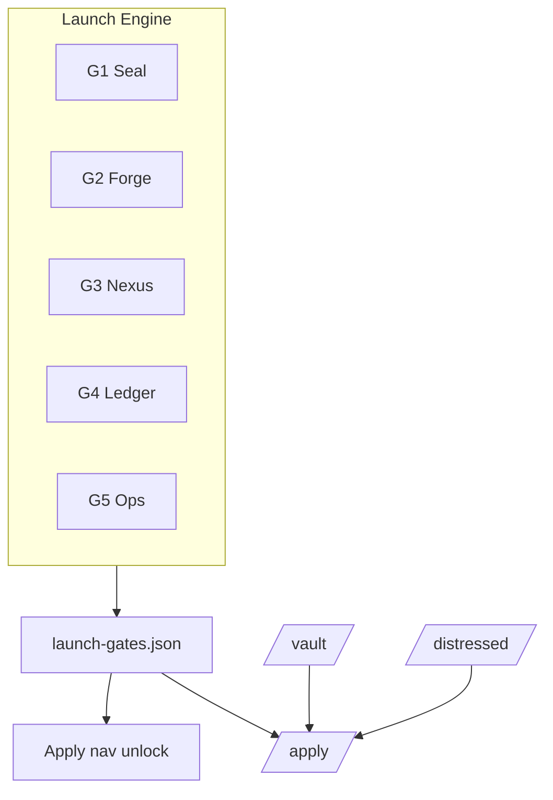

# MotoPass Technical Architecture (Initial)

**BUILD-2026.07.14-33**

This is a living high-level architecture document. It will be expanded as implementation proceeds. For now it codifies the principles, current state, and intended evolution so that the Vite/React work, data pipeline, Nostr/Lightning integration, and self-hosting path all pull in the same direction.

## Guiding Principles

1. **Verifiability First** — “Truth You Can Verify” is a product requirement, not a marketing line. It shapes data model, UI, payments, updates, and deployment.
2. **Local-First / User Sovereignty** — User data (portfolios, stacks, notes, trackers) belongs to the user. Central servers are conveniences, not owners.
3. **Bitcoin Rails as Happy Path** — Lightning (BOLT12), Silent Payments, Liquid, on-chain, and on-chain timestamps are first-class. Fiat is fallback.
4. **Nostr as Identity & Coordination Layer** — Pubkeys over emails. Events for updates, alerts, and (sanitized) sharing. Private relays for sensitive context.
5. **Agent-Friendly & Auditable Process** — Single source of truth folder. BUILD numbering. Handoff skill. Documentation updated with (or before) code changes.
6. **Beauty is Non-Negotiable** — DESIGN.md is binding for all customer surfaces.
7. **Phased, Not Big-Bang** — The pristine static demo is valuable today. The modern app evolves it. Integrations come online when the data and UX are ready to support them.

## Current State (BUILD-33)

**React SPA (primary)**
- Vite + React 18 + TypeScript + Tailwind — 18 routes, lazy-loaded pages.
- **Sovereign Night default** — glassmorphism cards, BTC grid/hash textures, `GlassCard` component.
- **Canonical nav** — `src/lib/navRoutes.ts` · Programs · Vault · Distressed · BTC Map · Simulator · Compare · Agents · Apply (no Explore/Tools duplicates).
- `ProgramsContext` fetch-once cache; local portfolio/stacks via `localStorage`.
- Playwright e2e (19 tests), Vitest unit tests (36), CI bundle budget.

**Sovereign Stack v2.3 (Launch Engine)**
- **Seal:** Vault page (`/vault`) — OTS upload, hash verify, 50/50 flagship proofs on disk.
- **Forge:** Distressed marketplace (`/distressed`) — curated + permissionless lanes, PSBT escrow stub.
- **Nexus:** Apply flow (`/apply`) — gated by `public/launch-gates.json` from `npm run launch:gate`.
- **Ledger:** `research/oracle-seed.json` + Kimi handoff; 50-jurisdiction `countries.json`.
- **Ops:** `validate:data` · `validate:stamps` · `validate:seal` · `launch:gate` scorecard.

**BTC Map integration (v2)**
- External API: [btcmap-api](https://github.com/teambtcmap/btcmap-api) v4 (`api.btcmap.org`).
- Client: `src/lib/btcmap.ts` — search, areas, saved places (Bearer after NIP-98).
- Auth: `src/lib/btcmapAuth.ts` — Nostr NIP-98 → `POST /v4/auth/nostr`.
- Offline: `public/data/btcmap/{slug}.json` — cache-first in `useBtcMapPlaces`.
- Density: `public/data/btcmap-density.json` — pre-fetched merchant counts for card badges.
- Map UI: `react-leaflet@4` + OSM tiles (replaces iframe embed).
- Sync scripts: `npm run btcmap:density`, `npm run btcmap:sync`.

**Static assets**
- `website/index.html` — zero-build reference dashboard.
- `research/countries.json` — 50 programs.
- `public/data/` — BTC Map snapshots copied to `dist/data/` at build.

**Process**
- Two-machine M3 (dev) / M4 (memory + strategy) with giveabit-project-handoff skill.
- Cloudflare Pages deploy to project `motopass` only.

**No MotoPass backend**
- Program data and BTC Map cache are static JSON. Live merchant data fetched client-side from btcmap.org API.

## Target High-Level Architecture (Phase 1–2+)

```
┌─────────────────────────────────────────────────────────────┐
│                        User Surfaces                         │
│  - Pristine static demo (website/index.html) — reference     │
│  - Modern SPA (Vite + React + TS + Tailwind) — primary       │
│  - PWA / future mobile companions                            │
│  - Self-hosted bundles (static + optional server components) │
└─────────────────────────────────────────────────────────────┘
                              │
                              ▼
┌─────────────────────────────────────────────────────────────┐
│                     Client / Local State                     │
│  - IndexedDB / localStorage for Portfolio, Saved Stacks,     │
│    Application Trackers, Preferences                         │
│  - Data packs: fetched or bundled versioned JSON + proofs    │
│  - Optional: Nostr-published (sanitized) public artifacts    │
└─────────────────────────────────────────────────────────────┘
                              │
        ┌─────────────────────┼─────────────────────┐
        ▼                     ▼                     ▼
┌───────────────┐   ┌───────────────────┐   ┌───────────────┐
│   Nostr       │   │  Lightning / BTC  │   │  Timestamping │
│  (Identity,   │   │  (Payments,       │   │  (OTS +       │
│   Alerts,     │   │   Invoices,       │   │   Satohash)   │
│   Pub/Sub,    │   │   Receipts)       │   │               │
│   Paige DMs)  │   │                   │   │               │
└───────────────┘   └───────────────────┘   └───────────────┘
        │                     │                     │
        └─────────────────────┼─────────────────────┘
                              ▼
┌─────────────────────────────────────────────────────────────┐
│              Optional Hosted / Coordination Layer            │
│  - Paige relay or hybrid (grounded responses + proactive)    │
│  - Stamping coordination (user pays small Lightning fee)     │
│  - Marketplace coordination (listings, reputation, escrow)   │
│  - Anonymized B2G data products                              │
│  - Public demo / marketing hosting                           │
│  - (All optional — self-hosters can bypass)                  │
└─────────────────────────────────────────────────────────────┘
```

## Data & Provenance Flow

1. Research (agents, humans, oracles) produces updates to `research/countries.json` or legal extracts.
2. Material changes are stamped (OpenTimestamps + Satohash).
3. A new data pack (or Nostr delta event) is published with proof references.
4. Clients fetch / receive the pack or events.
5. UI renders with visible “as of block X — verify” treatment.
6. User actions (acquire, save stack, pay) can themselves be stamped, producing portable receipts.

## Component & Code Organization (Modern App)

(Will be refined as the Vite app grows.)

- `src/data/` — loaders for countries.json, pack metadata, price feeds
- `src/components/` — sovereign-themed primitives + feature components (ProgramCard, StackSimulator, FinanceModal, ProofBadge, PaigeChat, etc.)
- `src/lib/` — stacking math, tax synergy models, filter logic, export generators, stamp helpers
- `src/stores/` or hooks — local state (portfolio, stacks, filters)
- `src/integrations/` — nostr (ndk or simple), lightning (webln / alby / btcpay), ots/satohash client
- `src/pages/` or routes — Portfolio, Explorer, Simulator, Compare, Vault, Settings
- `public/` or served assets — the research/ folder (or symlinked/copied at build for demo parity)

Use `docs/DESIGN-CONTEXT.md`, `docs/DESIGN-TOKENS.md`, and `docs/NEXT-PROMPT.md` as the source of truth for layout and interaction.

## Deployment Models

1. **Public Hosted (Convenience)** — Netlify / Cloudflare Pages / GitHub Pages for the SPA + static assets + research data. Fastest path to sharing the demo.
2. **Sovereign Static** — User downloads the built static bundle + a copy of the data pack. Runs entirely locally/offline after first load. Can be served from Umbrel/Start9/nginx.
3. **Sovereign with Rails** — Static bundle + local Lightning node (LND/CLN) + optional local Paige (via llama.cpp or similar) + local OTS calendar. Maximum independence.
4. **Hybrid** — Hosted intelligence + user’s own Nostr relays + own Lightning for payments.

Long-term goal: excellent experience at all three levels, with clear documentation and one-command (or one-click on Start9/Umbrel) self-host recipes.

## Security & Privacy Posture

- Minimize central collection of user data.
- Nostr private relays for anything sensitive (stacks, Paige context, notes).
- All high-value or auditable actions produce optional on-chain proofs.
- No central KYC for the core intelligence, simulation, and basic Paige features.
- Self-hosting is a first-class, documented path, not an afterthought.
- Dependencies are kept minimal and auditable (Vite ecosystem, small Nostr/Lightning libs, no heavy analytics).

## BTC Map Data Flow

```
Build time (optional refresh)
  npm run btcmap:density  → public/data/btcmap-density.json
  npm run btcmap:sync     → public/data/btcmap/{slug}.json

Runtime (/btcmap page)
  1. loadBtcMapSnapshot(programName)  — instant from /data/btcmap/{slug}.json
  2. searchPlacesNearby + getAreasAt    — live API refresh (api.btcmap.org)
  3. BtcMapLeaflet renders pins + search-radius circle

Auth (optional — save merchants)
  window.nostr.signEvent → NIP-98 token → POST /v4/auth/nostr
  Bearer token in sessionStorage → POST/DELETE /v4/places/saved

Program cards
  BtcMapDensityProvider loads btcmap-density.json once
  MerchantDensityBadge shows count + tier per jurisdiction
```

Env vars: `VITE_BTCMAP_API_URL` (default `https://api.btcmap.org`), `VITE_BTCMAP_WEB_URL` (default `https://btcmap.org`).

## Integration Points

- **BTC Map**: v4 REST client, offline cache, NIP-98 saves — see above. Community tagging via btcmap.org/add-location and [btcmap-cli](https://github.com/teambtcmap/btcmap-cli).
- **Satohash / OTS**: client-side stamping guidance + optional hosted coordination.
- **Nostr**: nostr-tools; MotoPass connect stub + BTC Map NIP-98 auth; future event kinds for program updates, Paige.
- **Lightning**: WebLN, Alby SDK, or BTCPay for invoices; BOLT12 offer support; Silent Payments address generation/display.
- **Price feeds**: simple BTC/USD (and sats conversion) for the real-time calculators. Self-hostable or user-configurable.
- **Paige**: retrieval over stamped corpus; Nostr bot interface; optional local LLM path.

## Risks & Constraints

- Reliance on external explorers/calendars/relays → provide fallbacks and clear “verify independently” paths.
- Lightning / Nostr ecosystem maturity → graceful degradation + clear happy-path guidance.
- Data update velocity → Nostr + stamping pipeline must be maintainable by a small agent + human team.
- Scope discipline → this document + the phased roadmap in PRODUCT-SCOPE-ROADMAP.md are the guardrails.

## Navigation (BUILD-33)

Single source of truth: `MAIN_NAV_ROUTES` in `src/lib/navRoutes.ts`.

| Surface | Links |
|---------|-------|
| Desktop nav | All 8 in order + Register/Dashboard pill |
| Mobile hamburger | Same 8 · 2-column grid |
| Mobile bottom bar | Programs · Vault · Distressed · Apply · More |
| More sheet | BTC Map · Simulator · Compare · Agents |
| Footer | Same 8 + account links · `NavLink` active states |

## Launch Engine (BUILD-32+)

Five gates must pass before `applications_open` in `public/launch-gates.json`:

| Gate | Pillar | Check |
|------|--------|-------|
| G1 | Seal | 50/50 flagships · OTS on disk · Satohash proofs |
| G2 | Forge | Vault + Distressed UI · ≥40 listing candidates |
| G3 | Nexus | Nostr relay NIP-11 (or `LAUNCH_FAKE_RELAY=1` for QA) |
| G4 | Ledger | `oracle-seed.json` · KIMI-HANDOFF · 50 programs |
| G5 | Ops | `validate:data` · `validate:stamps` · `validate:seal` · `dist/` |



Run: `npm run launch:gate` · Ship: `npm run deploy:all`

## Next Immediate Architecture Work

- Live MotoPass Nostr relay (`LAUNCH_FAKE_RELAY=0`) for production G3.
- Real PSBT escrow (BUILD 31+) after legal sign-off.
- Weekly CI cron for `btcmap:sync` + density refresh + Kimi oracle diffs.
- Stop committing `dist/` — generate in CI only.

**Truth You Can Verify — in the code, in the data, and in the deployment.**

— Architecture Layer, MotoPass  
BUILD-2026.07.14-33

Cross-references: `docs/PRODUCT-SCOPE-ROADMAP.md`, root `PROJECT-VISION.md`, `DESIGN.md`, `DATA-MODEL.md`.